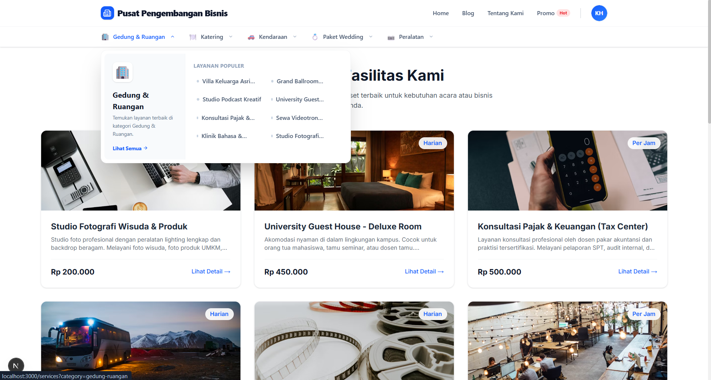
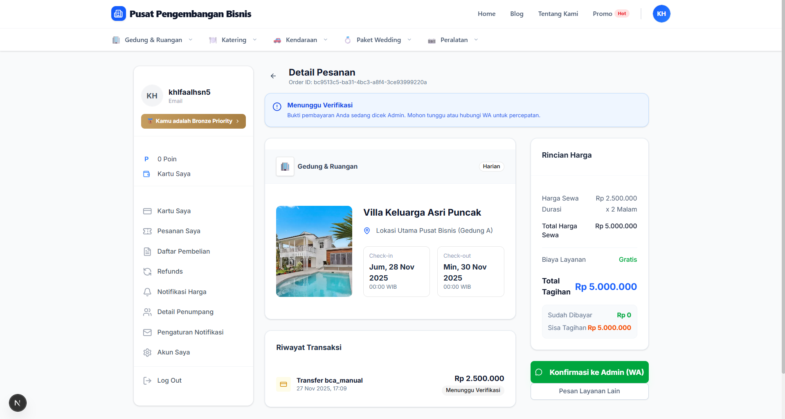
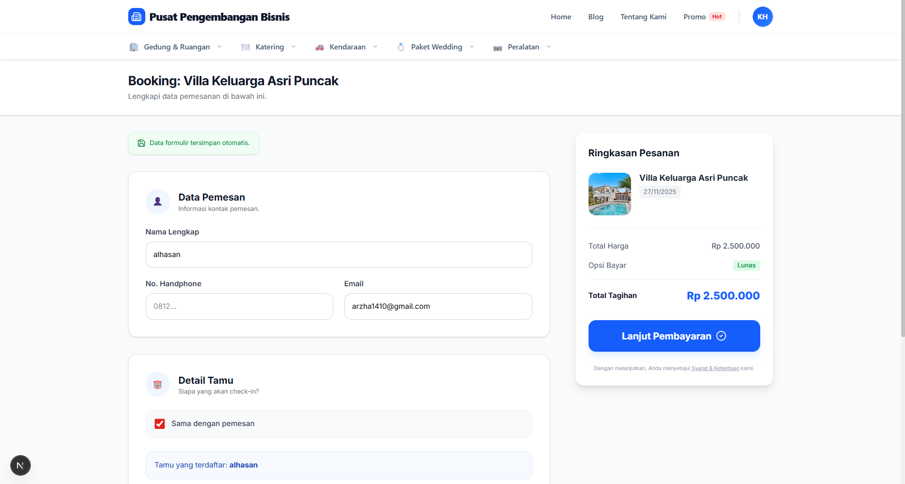
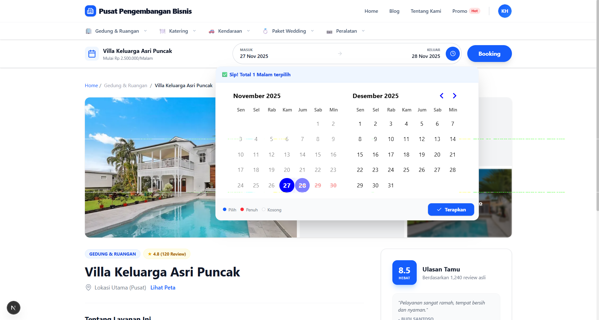

# 🏢 Pusat Pengembangan Bisnis

### Modern Booking Platform

Platform reservasi aset bisnis dengan pengalaman ala aplikasi travel seperti **Traveloka**.  
Mendukung pembayaran **DP/Lunas**, verifikasi admin real-time, dan **E-Ticket berbasis QR Code**.

---

<div align="center">

### 🚀 Tech Stack


</div>

---

## 🌟 Fitur Utama

### 👤 Untuk Pengguna

✅ **Traveloka-Style Booking Flow**  
Pilih Tanggal → Isi Data → Bayar

✅ **Smart Calendar**

- Block tanggal _Pending_ & _Confirmed_
- Sewa Harian & Per Jam

✅ **Flexible Payment**

- Lunas / DP 50%
- Anti double-payment

✅ **User Dashboard**

- Status real-time
- Upload bukti transfer
- Riwayat pesanan

✅ **Wishlist**
Simpan layanan favorit.

✅ **Form Persistence**
Data form tidak hilang saat refresh.

✅ **E-Ticket PDF + QR Code**
Aktif setelah pembayaran lunas.

---

### 🛡️ Untuk Admin

✅ Dashboard Manajemen  
✅ Verifikasi Pembayaran (Approve/Reject)  
✅ CRUD Services + Multi-Image Upload  
✅ Dynamic Spec (JSONB)  
✅ Auto Slug URL  
✅ QR Scanner via Kamera HP/Laptop

---

## 🛠️ Teknologi

| Kategori        | Teknologi                   |
| --------------- | --------------------------- |
| Framework       | Next.js 15 (App Router)     |
| Bahasa          | TypeScript                  |
| Database & Auth | Supabase (PostgreSQL)       |
| UI              | Tailwind CSS + Shadcn/ui    |
| Form            | React Hook Form + Zod       |
| Tanggal         | Date-fns + React-day-picker |
| PDF             | @react-pdf/renderer         |
| QR Scanner      | @yudiel/react-qr-scanner    |
| Notifikasi      | Sonner Toast                |

---

## 🚀 Cara Menjalankan

### 1️⃣ Clone Repository

```bash
git clone https://github.com/username-anda/ppbisnis-project.git
cd ppbisnis-project
```

### 2️⃣ Install Dependencies

```bash
npm install
```

### 3️⃣ Setup Environment

Buat file **.env.local**:

```
NEXT_PUBLIC_SUPABASE_URL=https://your-project-id.supabase.co
NEXT_PUBLIC_SUPABASE_ANON_KEY=your-anon-key-here
```

### 4️⃣ Setup Database di Supabase

Pastikan tabel berikut ada:

- profiles
- categories
- services
- bookings
- payments
- saved_services

✅ Sertakan trigger & function status pembayaran.

### 5️⃣ Run Development

```bash
npm run dev
```

Buka di browser:  
👉 http://localhost:3000 ✅

---

## 📂 Struktur Direktori

```
app/
 ├── (main)/
 │    ├── services/
 │    ├── book/
 │    ├── dashboard/
 ├── (admin)/
 │    ├── bookings/
 │    ├── services/
 │    ├── scan/
 ├── (checkout)/
 │    ├── payment/
 ├── layout.tsx
```

---

## 📸 Screenshots

<table>
  <tr>
    <td align="center">
      
    </td>
    <td align="center">
      
    </td>
  </tr>
  <tr>
    <td align="center">
      
    </td>
    <td align="center">
      
    </td>
  </tr>
</table>

## 🤝 Kontribusi

**1️⃣ Fork repo**

**2️⃣ Buat branch baru**

```bash
git checkout -b fitur-baru
```

**3️⃣ Commit perubahan**

```bash
git commit -m "Menambah fitur baru"
```

**4️⃣ Push branch**

```bash
git push origin fitur-baru
```

**5️⃣ Buat Pull Request ✅**

---

## 📄 Lisensi

Proyek ini menggunakan **MIT License**.  
Detail ada di file `LICENSE`.

---

<div align="center">

⭐ **Jangan lupa kasih Star kalau project ini bermanfaat!** ⭐

</div>
